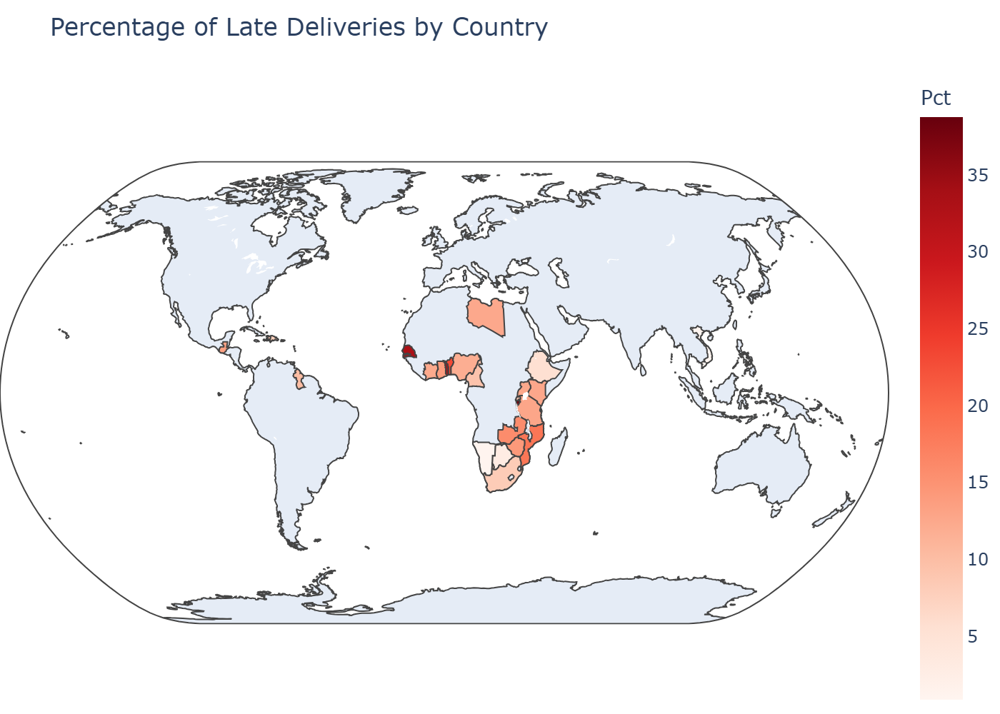

# shanthedataartist
Every empire stands on grains of dust.

This is A personal Collection of my projects.

----

## Restaurant Analytics (Level 1 and 2) [Cognifyz Internship]
 
Task – Restaurant Data Analysis & Business Intelligence  

For this task, I analyzed a global restaurant dataset to uncover cuisine trends, customer preferences, and chain performance. Using Python (Pandas for wrangling, Matplotlib/Seaborn for visualization, and Folium/Plotly for mapping), I turned raw data into actionable business insights.  

🔹 Steps Taken  

• Data Wrangling: Cleaned and structured dataset with data dictionary and handling of chains.  
• Feature Engineering: Created **Weighted Rating Numerators** and applied **Bayesian Weighted Rating logic** to filter out small-sample bias.  
• Cuisine Analysis: Identified most **common** and **popular** cuisine combinations by frequency and demand.  
• Chain Analysis: Evaluated 734 restaurant chains across rating tiers (top-rated, average, low-rated).  
• Geographic Mapping: Visualized restaurant density and hotspots across countries using interactive maps.  
• BI Framing: Converted statistical insights into business intelligence recommendations (expansion, pricing, delivery strategy, and brand benchmarking).  

📊 Key Insights Identified  

✔ Most ratings fall between **3.5–4.5**, with ~202 votes on average — social proof drives trust.  
✔ **North Indian + Chinese** is the most frequent combo, while **Fast Food + Healthy/American** combos dominate popularity.  
✔ Premium cuisines (Sushi, Burgers, Continental-Italian) consistently achieve weighted ratings ≥4.  
✔ Big QSR chains (McDonald’s, Subway, KFC) cluster in the “average-rated” range despite high reach.  
✔ **Barbeque Nation** and **Absolute Barbecues** emerge as high-rated, high-volume leaders.  
✔ Domino’s shows strong reach but low satisfaction (avg. rating 3.4) → brand risk.  

🔑 Takeaways  

• Expansion → Focus on Delhi NCR & Indian metros; test suburban growth in US East Coast.  
• Cuisine Mix → Strengthen Indo-Chinese, Mughlai, Fast Food; scale premium Sushi/Continental niches.  
• Pricing → Stay affordable (Price Range 1 & 2 dominate).  
• Delivery → Huge opportunity but fix **quality gaps** (packaging, timeliness).  
• Chains → QSR giants need menu/service innovation; premium chains should **scale aggressively**.  

✨ Learning Outcome  

• Enhanced my ability to apply **Bayesian weighted logic** in real-world datasets.  
• Learned to combine statistical rigor with **business intelligence framing**.  
• Gained insights into how data analytics can guide **menu design, expansion strategy, and customer experience**.  

---- 

# 📦 FedEx Exploratory Data Analysis (EDA) Project

This project analyzes **10,324 FedEx shipment records** to uncover patterns in **delivery delays, shipment costs, fulfillment methods, and vendor contracts**.  
The aim is to demonstrate how structured **data cleaning, transformation, and visualization** can translate raw logistics data into meaningful **business insights**.

---

## 🚀 Project Objectives
- Identify the factors driving **on-time vs delayed deliveries**.
- Explore the relationship between **freight costs, shipment weights, and modes of transport**.
- Compare fulfillment methods (Direct Drop vs RDC) and **INCO terms**.
- Provide actionable **business takeaways** for cost optimization and reliability improvement.

---

## 🛠️ Tech Stack & Tools
- **Python Libraries**: Pandas, NumPy, Matplotlib, Seaborn, Plotly, Folium  
- **Data Cleaning**: Regex, datetime parsing, missing-value handling, outlier treatment  
- **Visualization**: Static plots (Matplotlib/Seaborn), interactive charts (Plotly), geospatial maps (Folium/Choropleth)  
- **Data Size**: 10,324 rows × 33 columns  

---

## 📂 Project Workflow

1. **Data Import & Setup**
   - Loaded CSV dataset into Pandas DataFrame.  
   - Inspected shape, column types, null values, and duplicates.  

2. **Data Wrangling**
   - Standardized column names.  
   - Converted date fields to datetime.  
   - Resolved messy text fields (`Weight`, `Freight Cost`) into numeric features.  
   - Engineered new columns:
     - `Delivery_Delay` (days early/late vs schedule)  
     - `Delivery_Status` (*Early*, *On-Time*, *Late*)  

3. **Exploratory Data Analysis**
   - **Univariate**: Histograms, boxplots, violin plots to study delay distributions and outliers.  
   - **Bivariate/Multivariate**: Scatterplots (weight vs cost, cost vs delay), barplots (fulfillment vs delay), pie charts (management concentration).  
   - **Geospatial**: Choropleth map showing % of late deliveries by country.  

4. **Insights & Business Takeaways**
   - Direct Drop = most reliable; RDC adds variability.  
   - Air = lowest delay % (9%), Trucks = highest (16%).  
   - Ocean = cheapest for heavy loads, but delays common.  
   - Freight cost does **not** guarantee on-time delivery.  
   - Outliers (very high weight/cost) distort analysis and require special handling.  

---

## 📊 Key Findings

- **Air transport dominates** (61% shipments) and is most reliable.  
- **Truck shipments** suffer the highest variability in delays.  
- **Ocean shipments** are cost-efficient but risk-prone.  
- **EXW Incoterm** emerges as the most reliable contract type.  
- **RDC operations** show high unpredictability, needing optimization.  

---

## 🔎 Sample Visuals

---

## 📌 Business Recommendations

- Use **Air** for time-critical shipments despite higher costs.  
- Optimize **RDC workflows** to reduce both early and late deliveries.  
- Reserve **Air Charter** for emergencies (too costly otherwise).  
- Employ **Ocean** for bulk, non-urgent cargo.  
- Track **outlier shipments** (extreme cost/weight) as risk factors.  

---

## 📖 Learning Outcomes

This project reflects my **Month 3 journey into Data Science**, showcasing skills in:  
- **Data Wrangling** with Pandas & Regex  
- **Feature Engineering** for new insights  
- **EDA & Visualization** (Matplotlib, Seaborn, Plotly, Folium)  
- **Business Storytelling** – turning raw data into actionable strategy  

---

## 📝 Acknowledgements
This dataset and project form part of my **AlmaBetter Data Science program**.  
Grateful to AlmaBetter, Amity Online, and Woolf University for structured learning and support.

---------------